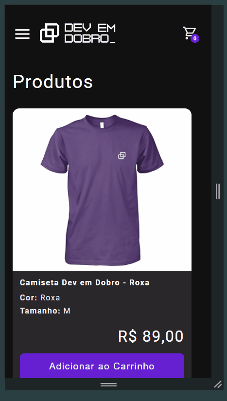
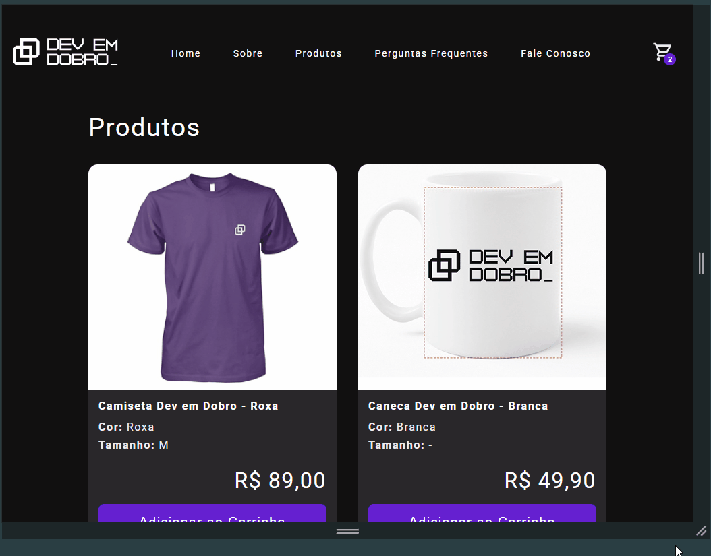

# 🏍️ E-commerce Master

O **E-commerce Master** é uma loja virtual fictícia desenvolvida com HTML, CSS e JavaScript puro. O projeto prioriza responsividade, acessibilidade e código modular. Conta com um carrinho de compras funcional, cálculo de frete via API, menu responsivo e modal interativo.

---

## 📸 Screenshots

| 📱 Versão Mobile | 💻 Versão Desktop |
|------------------|-------------------|
|  |  |

---

## ⚛️ Como Rodar o Projeto

1. Clone o repositório:

   ```bash
   git clone https://github.com/slayer-br/projeto-ecommerce.git
   ```

2. Abra o arquivo `index.html` no navegador.

> ✅ Nenhum servidor backend ou instalação de dependências é necessário.

---

## 🛠️ Tecnologias e Padrões

* HTML5 semântico
* CSS3 com variáveis, media queries e layout mobile-first
* JavaScript moderno (ES6 Modules)
* Organização modular de arquivos
* Acessibilidade e usabilidade como prioridade

---

## 🎨 Estilo e Tipografia

* Cores principais: Roxo, verde-claro e cinza-escuro
* Fonte: Roboto (Google Fonts via CDN)
* Unidades responsivas com `rem`
* Variáveis CSS centralizadas com `:root` para facilitar manutenção

---

## 📱 Layout Responsivo

O layout foi desenvolvido com abordagem **mobile-first**:

* Colunas empilhadas em telas pequenas
* Grid de produtos com múltiplas colunas em tablets e desktops
* Menu hamburguer para dispositivos móveis
* Menu horizontal adaptado para telas maiores

---

## ⚙️ Funcionalidades Avançadas

### 🛒 Carrinho Inteligente

* Adição e remoção de produtos com persistência via `localStorage`
* Controle de quantidade diretamente no modal do carrinho
* Máscara de CEP com validação em tempo real
* Subtotal e total atualizados automaticamente

### 🌐 Cálculo de Frete com API

* Integração com [n8n](https://n8n.io/) via `fetch` (webhook público)
* Envio de dados estruturados dos produtos (peso, dimensões) com base em `measures-products.json`
* Retorno do valor do frete, exibido dinamicamente
* Revalidação automática ao alterar itens do carrinho

### 🧰 Arquitetura Modular

O código JavaScript está separado por responsabilidade:

* `cartServices.js`: Lógica de carrinho (adicionar, remover, atualizar)
* `shippingServices.js`: Cálculo e controle de exibição do frete
* `utilities.js`: Validações, como verificação de CEP
* `cart.js`: Integra a DOM com os serviços
* `menu.js` e `modal.js`: Interações da interface

### 🧠 Experiência do Usuário (UX)

* Máscara automática e validação de CEP
* Feedback visual para erros
* Prevenção de valores inválidos nas quantidades
* Atualizações em tempo real sem recarregar a página

---

## 📂 Organização de Arquivos

```plaintext
.
├── assets/
│   └── images/              # Imagens do projeto (produtos e ícones)
├── css/
│   ├── reset.css            # Reset de estilos cross-browser
│   └── style.css            # Estilos principais da aplicação
├── js/
│   ├── services/
│   │   ├── cartServices.js       # Lógica do carrinho
│   │   └── shippingServices.js   # Lógica de frete
│   ├── utilities/
│   │   └── utilities.js          # Validações auxiliares
│   ├── cart.js                   # Controlador principal do carrinho
│   ├── measures-products.json    # Dimensões e pesos dos produtos
│   ├── menu.js                   # Comportamento do menu
│   └── modal.js                  # Comportamento do modal
├── index.html                    # Página principal
```

---

## 📚 Bibliotecas Externas

* [MicroModal.js](https://micromodal.vercel.app/) – Para modais acessíveis
* [Google Fonts – Roboto](https://fonts.google.com/specimen/Roboto) – Tipografia principal

---

## ♿ Acessibilidade

O projeto considera práticas de acessibilidade como:

* Estrutura semântica (`<header>`, `<main>`, `<footer>`)
* Atributos `aria-*` nos modais
* Alto contraste e legibilidade da fonte
* Teclado navegável

---

## 📸 Imagens & Produtos

Os produtos são fictícios e utilizam imagens locais:

* `camiseta_roxa.jpg`
* `caneca_devemdobro.jpg`

Ícones em SVG personalizados estão localizados em `assets/images`.

---

## 📄 Licença

Este projeto está licenciado sob a licença [MIT](LICENSE).

---

## 👨‍💻 Autor

**Carlos Alberto da Silva**
🔗 [GitHub – @slayer-br](https://github.com/slayer-br)
